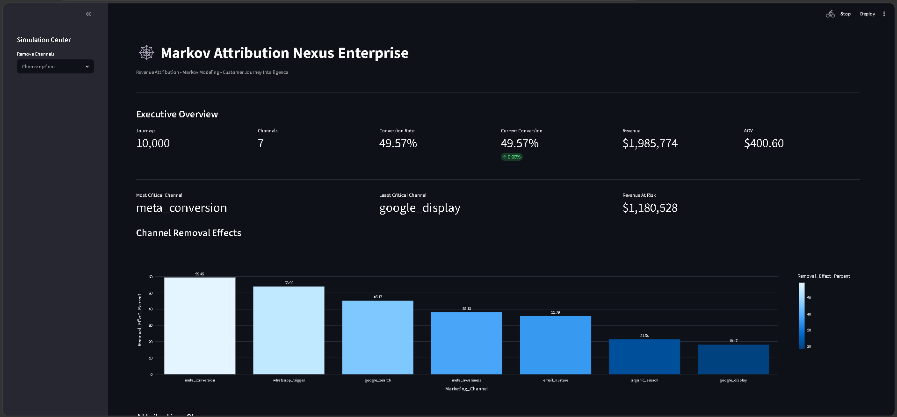

# Project Markov Nexus

## Revenue Attribution & Customer Journey Analytics Using Markov Chains

A production-style data analytics application that uses **Markov Chain modeling** to measure the true contribution of marketing channels across multi-touch customer journeys.

Built with **Python, Pandas, NumPy, Plotly, and Streamlit**, the project simulates customer acquisition funnels, calculates channel attribution, estimates revenue contribution, and evaluates the business impact of removing individual marketing channels.

---

## Dashboard Preview



---

## Project Motivation

Traditional attribution models such as:

* First Touch Attribution
* Last Touch Attribution
* Linear Attribution

often oversimplify customer behavior and fail to capture the interaction between multiple marketing channels.

Project Markov Nexus addresses this problem by treating customer journeys as a stochastic process and modeling transitions between marketing touchpoints using a Markov Chain framework.

This approach allows us to estimate:

* Conversion probability
* Channel importance
* Revenue contribution
* Revenue at risk
* Marketing dependency structures

---

## Business Problem

A marketing team wants to understand:

> Which channels truly drive conversions?

A user may interact with:

```text
Google Search
    ↓
Meta Awareness
    ↓
Email Nurture
    ↓
WhatsApp Trigger
    ↓
Conversion
```

Removing one channel can impact the entire conversion pathway.

Markov Attribution measures this impact by calculating the reduction in conversion probability when a channel is removed from the journey network.

---

## Methodology

### State Space

Customer journeys are represented as states:

```text
START
Google Search
Meta Awareness
Meta Conversion
Email Nurture
WhatsApp Trigger
Organic Search
CONVERSION
DROP_OFF
```

---

### Transition Probability Matrix

For every observed journey transition:

```math
P_{ij} =
\frac{C_{ij}}
{\sum_k C_{ik}}
```

Where:

* (C_{ij}) = number of transitions from state i to state j
* (P_{ij}) = probability of moving from state i to state j

The resulting matrix represents customer movement through the funnel.

---

### Conversion Probability Simulation

The engine propagates probability mass through the transition network until absorption into:

```text
CONVERSION
or
DROP_OFF
```

The resulting value represents the expected conversion probability of the entire system.

---

### Removal Effect Analysis

For each marketing channel:

1. Remove the channel from the network
2. Redirect traffic to DROP_OFF
3. Recalculate conversion probability

The removal effect is calculated as:

```math
R_c =
\frac
{
BaseConversion - ConversionWithoutChannel
}
{
BaseConversion
}
```

Higher values indicate more important channels.

---

## Revenue Attribution

The system extends traditional Markov Attribution by assigning revenue impact.

Revenue generated by conversions is distributed proportionally across channels according to their removal effects.

Outputs include:

* Channel Revenue Attribution
* Revenue Loss if Removed
* Total Revenue Contribution
* Funnel Risk Analysis

---

## Features

### Analytics Engine

* Markov Chain transition modeling
* Channel removal effect calculation
* Conversion probability simulation
* Revenue attribution modeling
* Revenue loss estimation
* Transition matrix generation

### Interactive Dashboard

* Executive KPI dashboard
* Channel importance ranking
* Revenue attribution charts
* Revenue loss simulation
* Channel blackout testing
* Transition matrix inspection
* Dataset explorer
* CSV export functionality

---

## Project Structure

```text
Project_Markov_Nexus/
│
├── assets/
│   └── nexus_preview.png
│
├── core_logic/
│   └── user_journey_sequences.csv
│
├── generate_journeys.py
├── engine.py
├── app.py
├── requirements.txt
└── README.md
```

---

## Sample Dataset

The project generates synthetic customer journey data containing:

```text
10,000 customer journeys
7 marketing channels
Revenue per conversion
Customer segments
Journey timestamps
Conversion outcomes
```

Example:

```text
Organic Search
    →
Meta Awareness
    →
Email Nurture
    →
Conversion
```

---

## Technologies Used

### Programming

* Python 3.13

### Data Analytics

* Pandas
* NumPy

### Visualization

* Plotly

### Dashboard

* Streamlit

### Modeling

* Markov Chains
* Transition Matrices
* Stochastic Simulation
* Attribution Modeling

---

## Example Results

Generated Dataset:

```text
10,000 Journeys
4,957 Conversions
$1.99M Revenue
```

Top Performing Channel:

```text
Meta Conversion
```

Estimated Revenue Contribution:

```text
$433,759
```

Estimated Revenue Loss if Removed:

```text
$1.18M
```

---

## Installation

Clone the repository:

```bash
git clone https://github.com/amosfridayOGB/Project_Markov_Nexus.git
cd Project_Markov_Nexus
```

Install dependencies:

```bash
pip install -r requirements.txt
```

Generate customer journeys:

```bash
python generate_journeys.py
```

Run the analytics engine:

```bash
python engine.py
```

Launch the dashboard:

```bash
streamlit run app.py
```

---

## Learning Outcomes

This project demonstrates practical skills in:

* Data Analytics
* Machine Learning Foundations
* Probabilistic Modeling
* Marketing Analytics
* Software Engineering
* Data Visualization
* Business Intelligence
* Python Application Development

---

## Author

**Amos Friday Ogbonna**

Geology Graduate | Data Analytics & AI Enthusiast

Interested in:

* Data Science
* Business Analytics
* Artificial Intelligence
* Predictive Modeling
* Digital Transformation

---

## Future Improvements

* Higher-order Markov Chains
* Monte Carlo Simulation
* Customer Lifetime Value Modeling
* Real Marketing Platform Integration
* Bayesian Attribution Models
* Network Graph Visualization
* Forecasting Engine

---
